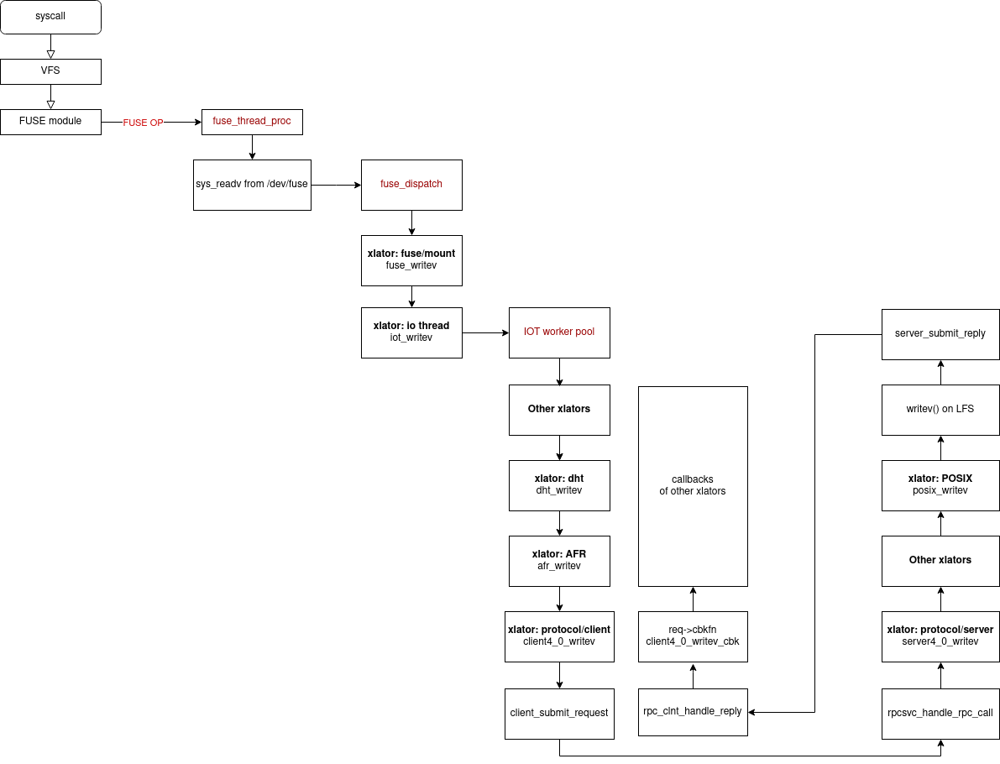

# 1. Initial workflow of GlusterFS clients and servers

Every server and client starts from the `main` function in `glusterfsd/src/glusterfsd.c`.

Main points are summarized below:

```c
glusterfsd/src/glusterfsd.c: main()

	glusterfs_ctx_defaults_init
		event_pool_new_epoll
			// Create an epoll instance and store the instand id epfd
			epfd = epoll_create(count);
			event_pool->fd = epfd;
	
	/*
		Initialize the root/first translator (fuse/mount) in clients.
		If it's not a a client node, just return without doing anything.
	*/
	create_fuse_mount
		xlator_init(root)
			__xlator_init
				init
					client_init_rpc
						client_rpc_notify
							client_handshake
								client_dump_version_cbk
									client_setvolume
        							// ...
        							client_setvolume_cbk
        							...
        							xlator_notify
        							/*	
        								Spawn several `fuse_thread_proc` for
        								reading out FUSE_OP from /dev/fuse.
        							*/
        							xlators/mount/fuse/src/fuse-bridge.c:6524 notify()

	gf_io_run	
		gf_io_main
			gf_event_dispatch
                /*
    				Spawn several threads to epoll (epoll_wait)
    				the registered events (mainly socket events) using `epoll_ctl`
    				on the event_pool->fd which is created by `epoll_create` above.
    			*/
				gf_thread_create(event_dispatch_epoll_worker)
					event_dispatch_epoll_worker
						...
							epoll_wait(event_pool->fd, ...)
```

Events are registered using `epoll_ctl` with the following traces:

```c
gf_event_register
				event_register -> event_register_epoll
					epoll_ctl(event_pool->fd, EPOLL_CTL_ADD, fd, &epoll_event);
```

For example,

```c
ret = gf_event_register(state->ctx->event_pool, 0, cli_rl_stdin, state, 1, 0, 0);
priv->idx = gf_event_register(ctx->event_pool, priv->sock,
                          socket_event_handler, this, 1, 1,
                          this->notify_poller_death);
priv->idx = gf_event_register(ctx->event_pool, priv->sock,
                          socket_server_event_handler, this, 1, 0,
                          this->notify_poller_death);
ew_priv->idx = gf_event_register(ctx->event_pool, new_sock,
                          socket_event_handler, new_trans,
                          1, 0, new_trans->notify_poller_death);
```

2. The function trace of a syscall `write` across clients and servers.


